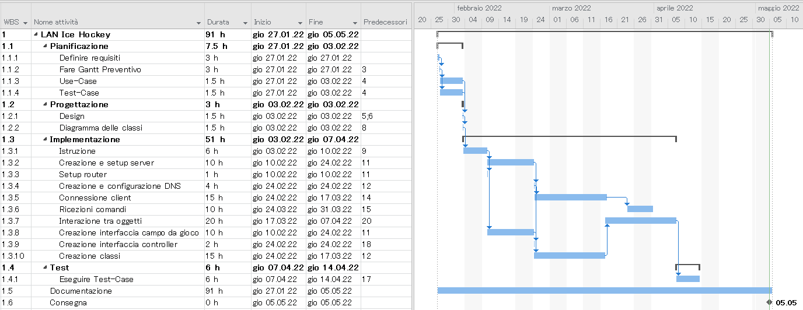

1. [Introduzione](#introduzione)

  - [Informazioni sul progetto](#informazioni-sul-progetto)

  - [Abstract](#abstract)

  - [Scopo](#scopo)

1. [Analisi](#analisi)

  - [Analisi del dominio](#analisi-del-dominio)
  
  - [Analisi dei mezzi](#analisi-dei-mezzi)

  - [Analisi e specifica dei requisiti](#analisi-e-specifica-dei-requisiti)

  - [Use case](#use-case)

  - [Pianificazione](#pianificazione)

1. [Progettazione](#progettazione)

  - [Design dell’architettura del sistema](#design-dell’architettura-del-sistema)

  - [Design dei dati e database](#design-dei-dati-e-database)

1. [Implementazione](#implementazione)

1. [Test](#test)

  - [Protocollo di test](#protocollo-di-test)

  - [Risultati test](#risultati-test)

  - [Mancanze/limitazioni conosciute](#mancanze/limitazioni-conosciute)

1. [Consuntivo](#consuntivo)

1. [Conclusioni](#conclusioni)

  - [Sviluppi futuri](#sviluppi-futuri)

  - [Considerazioni personali](#considerazioni-personali)

1. [Sitografia](#sitografia)

1. [Allegati](#allegati)

## Introduzione

### Informazioni sul progetto

- Allievi coinvolti nel progetto: Nathan Ferrari, Andrea Masciocchi, Xavier Horisberger
- Classe: I3AA Scuola Arti e Mestieri Trevano, sezione Informatica.
- Docenti responsabili: Luca Muggiasca.
- Data inizio: 27 gennario 2022
- Data di fine: 05 maggio 2022.

### Abstract

> *Have you ever wanted to play a simple game with your friends to have some fun, but didn't know what game to play? LANIceHockey enables you to play a simplefied version of ice hockey with your 
friends, and there are no limits to how many players can enter the match, everyone can play. You all connect yourselfs to the same network, a main computer with a sufficiantly big monitor will host 
the game, on it there will be the ice hockey field, meanwhile the controller to interact with your avatar will be on your phone. Now you and your friends can easily play together and have a good time.*

### Scopo

Lo scopo di questo progetto è di creare un videogioco sull'hockey su ghiaccio, il gioco è in una LAN a se stante, per giocare bisogna quindi collegarsi al router apposito, il campo sarà sul monitor dalla macchina
che ospita la partita, e il controller sarà sui telefoni delle persone che si uniscono alla partita. Non ci sono limiti su quanti giocatori possono entrare in partita, non ci sono presenti neanche le regole che sono normalmente
presenti in una partita di hockey. Il controller permette all'utente di muoversi, tirare e cambiare squadra. È anche presente una classifica dove si vedono i 10 giocatori che hanno segnato più goal.

## Analisi

### Analisi del dominio

  Questo capitolo dovrebbe descrivere il contesto in cui il prodotto verrà
  utilizzato, da questa analisi dovrebbero scaturire le risposte a quesiti
  quali ad esempio:

  -   Background/Situazione iniziale

  -   Quale è e come è organizzato il contesto in cui il prodotto dovrà
      funzionare?

  -   Come viene risolto attualmente il problema? Esiste già un prodotto
      simile?

  -   Chi sono gli utenti? Che bisogni hanno? Come e dove lavorano?

  -   Che competenze/conoscenze/cultura posseggono gli utenti in relazione
      con il problema?

  -   Esistono convenzioni/standard applicati nel dominio?

  -   Che conoscenze teoriche bisogna avere/acquisire per poter operare
      efficacemente nel dominio?

  -   …

### Analisi e specifica dei requisiti

  Il progettista, dopo aver ricevuto il mandato, in collaborazione con il
  committente redige una lista di requisiti. Durante questi incontri,
  tramite interviste (da inserire nei diari), il progettista deve cercare
  di rispondere alle seguenti domande:

  -   Quali sono i bisogni del committente?

  -   Quali funzioni deve svolgere il prodotto?

  -   Come devono essere implementate?

  -   L’utente, come vorrebbe/dovrebbe interagire con il prodotto?

  -   Come verrà utilizzato il prodotto?

  -   Che tipo di interfaccia si immagina?

  -   Che prestazioni minime deve fornire il prodotto?

  -   Che grado di sicurezza deve avere il prodotto?

  -   …

  In base alla lista dei requisiti e all’analisi degli stessi, il
  progettista redige una *specifica dei requisiti* in cui elenca e
  descrive in modo dettagliato quali sono le funzionalità che il prodotto
  fornirà. La specifica dovrebbe essere abbastanza dettagliata da poter
  essere utilizzata come base per lo sviluppo, ma non troppo; ad esempio
  non dovrebbe contenere dettagli di implementazione, o definizioni
  dettagliate dell’interfaccia grafica a meno che questi non siano
  considerati cruciali. Non si deve scordare che i requisiti non
  rappresentano delle attività bensì delle caratteristiche che il prodotto
  dovrà possedere.

  |**ID**	|**Nome**			|**Priorità**|**Vers**|**Note**  |
  |----|------------|--------|----|------|
  |Req-12|Dovrà esserci una maschera di login|1|1.0|...|
  |Req-13|Si dovranno poter immettere nuovi allievi|1|1.0|...|
  |Req-14|Dovrà essere possibile la ricerca di allievi|1|1.0|...|
  
  
|**ID: Req-001**|
|-|
|**Nome**      |Rappresentazione semi-reale di una partita di Hockey|
|**Priorità**  | 1                                    |
|**Versione**  | 1.0                                  |
|**Note**      |  |

|**ID: Req-002**|
|-|
|**Nome**      |La partita non ha un limite di giocatori|
|**Priorità**  | 2                                   |
|**Versione**  | 1.0                                  |
|**Note**      |  |

|**ID: Req-003**|
|-|
|**Nome**      |Gli utenti devono potersi collegare alla partita tramite telefono in LAN|
|**Priorità**  | 1                                  |
|**Versione**  | 1.0                                  |
|**Note**      |  |

|**ID: Req-004**|
|-|
|**Nome**      |Gli utenti devono poter muovere il loro giocatore telefono in LAN|
|**Priorità**  | 1                                  |
|**Versione**  | 1.0                                  |
|**Note**      |  |

|**ID: Req-005**|
|-|
|**Nome**      |Gli utenti devono poter tirare in porta|
|**Priorità**  | 2                                  |
|**Versione**  | 1.0                                  |
|**Note**      |  |

|**ID: Req-006**|
|-|
|**Nome**      |Devono esserci due squadre (verdi e gialli)|
|**Priorità**  | 2                                  |
|**Versione**  | 1.0                                  |
|**Note**      |  |

|**ID: Req-007**|
|-|
|**Nome**      |Gli utenti devono poter dare un nome al loro giocatore|
|**Priorità**  | 2                                  |
|**Versione**  | 1.0                                  |
|**Note**      |  |

|**ID: Req-008**|
|-|
|**Nome**      |Una volta assegnato il nome non può più essere cambiato|
|**Priorità**  | 3                                  |
|**Versione**  | 1.0                                  |
|**Note**      |  |

|**ID: Req-009**|
|-|
|**Nome**      |In alto a destra ci sarà una classifica con i 10 giocatori che hanno fatto più goal|
|**Priorità**  | 2                                  |
|**Versione**  | 1.0                                  |
|**Note**      |  |

|**ID: Req-010**|
|-|
|**Nome**      |I telefoni degli utenti agiranno solo da controller|
|**Priorità**  | 1                                  |
|**Versione**  | 1.0                                  |
|**Note**      |  |

|**ID: Req-011**|
|-|
|**Nome**      |Il campo di gioco viene visualizzato su un monitor a parte (non sugli schermi dei telefoni)|
|**Priorità**  | 1                                  |
|**Versione**  | 1.0                                  |
|**Note**      |  |

|**ID: Req-012**|
|-|
|**Nome**      |Il campo da gioco è visto dall’alto|
|**Priorità**  | 2                                  |
|**Versione**  | 1.0                                  |
|**Note**      |  |

|**ID: Req-013**|
|-|
|**Nome**      |La partita è infinita|
|**Priorità**  | 3                                  |
|**Versione**  | 1.0                                  |
|**Note**      |  |

|**ID: Req-014**|
|-|
|**Nome**      |Gli utenti devono potersi rubare il disco|
|**Priorità**  | 2                                  |
|**Versione**  | 1.0                                  |
|**Note**      |  |

**Spiegazione elementi tabella dei requisiti:**

**ID**: identificativo univoco del requisito

**Nome**: breve descrizione del requisito

**Priorità**: indica l’importanza di un requisito nell’insieme del
progetto, definita assieme al committente. Ad esempio poter disporre di
report con colonne di colori diversi ha priorità minore rispetto al
fatto di avere un database con gli elementi al suo interno. Solitamente
si definiscono al massimo di 2-3 livelli di priorità.

**Versione**: indica la versione del requisito. Ogni modifica del
requisito avrà una versione aggiornata.

Sulla documentazione apparirà solamente l’ultima versione, mentre le
vecchie dovranno essere inserite nei diari.

**Note**: eventuali osservazioni importanti o riferimenti ad altri
requisiti.

### Use case

Ecco il nostro Use Case:

> Use case

### Pianificazione

Abbiamo scelto una pianificazione waterfall:

> Gantt preventivo

### Analisi dei mezzi

Elencare e *descrivere* i mezzi disponibili per la realizzazione del
progetto. Ricordarsi di sempre descrivere nel dettaglio le versioni e il
modello di riferimento.

SDK, librerie, tools utilizzati per la realizzazione del progetto e
eventuali dipendenze.

Su quale piattaforma dovrà essere eseguito il prodotto? Che hardware
particolare è coinvolto nel progetto? Che particolarità e limitazioni
presenta? Che hw sarà disponibile durante lo sviluppo?

## Progettazione

Questo capitolo descrive esaustivamente come deve essere realizzato il
prodotto fin nei suoi dettagli. Una buona progettazione permette
all’esecutore di evitare fraintendimenti e imprecisioni
nell’implementazione del prodotto.

### Design dell’architettura del sistema

Descrive:

-   La struttura del programma/sistema lo schema di rete...

-   Gli oggetti/moduli/componenti che lo compongono.

-   I flussi di informazione in ingresso ed in uscita e le
    relative elaborazioni. Può utilizzare *diagrammi di flusso dei
    dati* (DFD).

-   Eventuale sitemap

### Design dei dati e database

Descrizione delle strutture di dati utilizzate dal programma in base
agli attributi e le relazioni degli oggetti in uso.

### Schema E-R, schema logico e descrizione.

Se il diagramma E-R viene modificato, sulla doc dovrà apparire l’ultima
versione, mentre le vecchie saranno sui diari.

### Design delle interfacce

Descrizione delle interfacce interne ed esterne del sistema e
dell’interfaccia utente. La progettazione delle interfacce è basata
sulle informazioni ricavate durante la fase di analisi e realizzata
tramite mockups.

### Design procedurale

Descrive i concetti dettagliati dell’architettura/sviluppo utilizzando
ad esempio:

-   Diagrammi di flusso e Nassi.

-   Tabelle.

-   Classi e metodi.

-   Tabelle di routing

-   Diritti di accesso a condivisioni …

Questi documenti permetteranno di rappresentare i dettagli procedurali
per la realizzazione del prodotto.

## Implementazione

In questo capitolo dovrà essere mostrato come è stato realizzato il
lavoro. Questa parte può differenziarsi dalla progettazione in quanto il
risultato ottenuto non per forza può essere come era stato progettato.

Sulla base di queste informazioni il lavoro svolto dovrà essere
riproducibile.

In questa parte è richiesto l’inserimento di codice sorgente/print
screen di maschere solamente per quei passaggi particolarmente
significativi e/o critici.

Inoltre dovranno essere descritte eventuali varianti di soluzione o
scelte di prodotti con motivazione delle scelte.

Non deve apparire nessuna forma di guida d’uso di librerie o di
componenti utilizzati. Eventualmente questa va allegata.

Per eventuali dettagli si possono inserire riferimenti ai diari.

## Test

### Protocollo di test

Definire in modo accurato tutti i test che devono essere realizzati per
garantire l’adempimento delle richieste formulate nei requisiti. I test
fungono da garanzia di qualità del prodotto. Ogni test deve essere
ripetibile alle stesse condizioni.

|Test Case      | TC-001                               |
|---------------|--------------------------------------|
|**Nome**       |Import a card, but not shown with the GUI |
|**Riferimento**|REQ-012                               |
|**Descrizione**|Import a card with KIC, KID and KIK keys with no obfuscation, but not shown with the GUI |
|**Prerequisiti**|Store on local PC: Profile\_1.2.001.xml (appendix n\_n) and Cards\_1.2.001.txt (appendix n\_n) |
|**Procedura**     | - Go to “Cards manager” menu, in main page click “Import Profiles” link, Select the “1.2.001.xml” file, Import the Profile - Go to “Cards manager” menu, in main page click “Import Cards” link, Select the “1.2.001.txt” file, Delete the cards, Select the “1.2.001.txt” file, Import the cards |
|**Risultati attesi** |Keys visible in the DB (OtaCardKey) but not visible in the GUI (Card details) |

### Risultati test

Tabella riassuntiva in cui si inseriscono i test riusciti e non del
prodotto finale. Se un test non riesce e viene corretto l’errore, questo
dovrà risultare nel documento finale come riuscito (la procedura della
correzione apparirà nel diario), altrimenti dovrà essere descritto
l’errore con eventuali ipotesi di correzione.

### Mancanze/limitazioni conosciute

Descrizione con motivazione di eventuali elementi mancanti o non
completamente implementati, al di fuori dei test case. Non devono essere
riportati gli errori e i problemi riscontrati e poi risolti durante il
progetto.

## Consuntivo

Consuntivo del tempo di lavoro effettivo e considerazioni riguardo le
differenze rispetto alla pianificazione (cap 1.7) (ad esempio Gannt
consuntivo).

## Conclusioni

Quali sono le implicazioni della mia soluzione? Che impatto avrà?
Cambierà il mondo? È un successo importante? È solo un’aggiunta
marginale o è semplicemente servita per scoprire che questo percorso è
stato una perdita di tempo? I risultati ottenuti sono generali,
facilmente generalizzabili o sono specifici di un caso particolare? ecc

### Sviluppi futuri
  Migliorie o estensioni che possono essere sviluppate sul prodotto.

### Considerazioni personali
  Cosa ho imparato in questo progetto? ecc

## Bibliografia

### Bibliografia per articoli di riviste
1.  Cognome e nome (o iniziali) dell’autore o degli autori, o nome
    dell’organizzazione,

2.  Titolo dell’articolo (tra virgolette),

3.  Titolo della rivista (in italico),

4.  Anno e numero

5.  Pagina iniziale dell’articolo,

### Bibliografia per libri

1.  Cognome e nome (o iniziali) dell’autore o degli autori, o nome
    dell’organizzazione,

2.  Titolo del libro (in italico),

3.  ev. Numero di edizione,

4.  Nome dell’editore,

5.  Anno di pubblicazione,

6.  ISBN.

### Sitografia

1.  URL del sito (se troppo lungo solo dominio, evt completo nel
    diario),

2.  Eventuale titolo della pagina (in italico),

3.  Data di consultazione (GG-MM-AAAA).

**Esempio:**

-   http://standards.ieee.org/guides/style/section7.html, *IEEE
    Standards Style Manual*, 07-06-2008.

## Allegati

Elenco degli allegati, esempio:

-   Diari di lavoro

-   Codici sorgente/documentazione macchine virtuali

-   Istruzioni di installazione del prodotto (con credenziali
    di accesso) e/o di eventuali prodotti terzi

-   Documentazione di prodotti di terzi

-   Eventuali guide utente / Manuali di utilizzo

-   Mandato e/o Qdc

-   Prodotto

-   …
