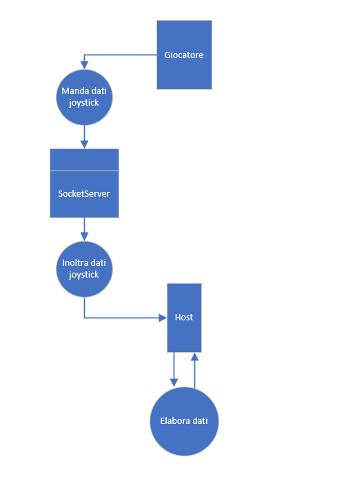

1. [Introduzione](#introduzione)

  - [Informazioni sul progetto](#informazioni-sul-progetto)

  - [Abstract](#abstract)

  - [Scopo](#scopo)

2. [Analisi](#analisi)

  - [Analisi del dominio](#analisi-del-dominio)

  - [Analisi dei mezzi](#analisi-dei-mezzi)

  - [Analisi e specifica dei requisiti](#analisi-e-specifica-dei-requisiti)

  - [Use case](#use-case)

  - [Pianificazione](#pianificazione)
3. [Progettazione](#progettazione)

  - [Design dell’architettura del sistema](#design-dell’architettura-del-sistema)

  - [Design dei dati e database](#design-dei-dati-e-database)

4. [Implementazione](#implementazione)

5. [Test](#test)

  - [Protocollo di test](#protocollo-di-test)

  - [Risultati test](#risultati-test)

  - [Mancanze/limitazioni conosciute](#mancanze/limitazioni-conosciute)

6. [Consuntivo](#consuntivo)

7. [Conclusioni](#conclusioni)

  - [Sviluppi futuri](#sviluppi-futuri)

  - [Considerazioni personali](#considerazioni-personali)

8. [Bibliografia](#bibliografia)

9. [Allegati](#allegati)

## Introduzione

### Informazioni sul progetto

- Allievi coinvolti nel progetto: Nathan Ferrari, Andrea Masciocchi, Xavier Horisberger
- Classe: I3AA Scuola Arti e Mestieri Trevano, sezione Informatica.
- Docenti responsabili: Luca Muggiasca.
- Data inizio: 27 gennario 2022
- Data di fine: 05 maggio 2022.

### Abstract

> *Have you ever wanted to play a simple game with your friends to have some fun, but didn't know what game to play? LANIceHockey enables you to play a simplefied version of ice hockey with your 
friends, and there are no limits to how many players can enter the match, everyone can play. You all connect yourselfs to the same network, a main computer with a sufficiantly big monitor will host 
the game, on it there will be the ice hockey field, meanwhile the controller to interact with your avatar will be on your phone. Now you and your friends can easily play together and have a good time.*

### Scopo

Lo scopo di questo progetto è di creare un videogioco sull'hockey su ghiaccio, il gioco è in una LAN a se stante, per giocare bisogna quindi collegarsi al router apposito, il campo sarà sul monitor dalla macchina
che ospita la partita, e il controller sarà sui telefoni delle persone che si uniscono alla partita. Non ci sono limiti su quanti giocatori possono entrare in partita, non ci sono presenti neanche le regole che sono normalmente
presenti in una partita di hockey. Il controller permette all'utente di muoversi, tirare e cambiare squadra. È anche presente una classifica dove si vedono i 10 giocatori che hanno segnato più goal.

## Analisi

### Analisi del dominio

  Il prodotto può essere utilizzato su qualsiasi piattaforma, ma bisogna essere collegati ad un router appositamente usato per questo progetto. 
  Una volta connessi al router si cerca il sito apposito, una volta sul sito del prodotto si può scegliere se essere l'host o se essere un giocatore. Può esserci un solo host e i giocatori possono connettersi alla partita solo se è già presente un host.

  Questo capitolo dovrebbe descrivere il contesto in cui il prodotto verrà
  utilizzato, da questa analisi dovrebbero scaturire le risposte a quesiti
  quali ad esempio:

  -   Background/Situazione iniziale

  -   Quale è e come è organizzato il contesto in cui il prodotto dovrà
      funzionare?

  -   Come viene risolto attualmente il problema? Esiste già un prodotto
      simile?

  -   Chi sono gli utenti? Che bisogni hanno? Come e dove lavorano?

  -   Che competenze/conoscenze/cultura posseggono gli utenti in relazione
      con il problema?

  -   Esistono convenzioni/standard applicati nel dominio?

  -   Che conoscenze teoriche bisogna avere/acquisire per poter operare
      efficacemente nel dominio?

  -   …

### Analisi e specifica dei requisiti
  
|**ID:** | **REQ-001**|
|-|-|
|**Nome**      |Rappresentazione semi-reale di una partita di Hockey|
|**Priorità**  | 1                                    |
|**Versione**  | 1.0                                  |

|**ID:** | **REQ-002**|
|-|-|
|**Nome**      |La partita non ha un limite di giocatori|
|**Priorità**  | 2                                   |
|**Versione**  | 1.0                                  |

|**ID:** | **REQ-003**|
|-|-|
|**Nome**      |Gli utenti devono potersi collegare alla partita tramite telefono in LAN|
|**Priorità**  | 1                                  |
|**Versione**  | 1.0                                  |

|**ID:** | **REQ-004**|
|-|-|
|**Nome**      |Gli utenti devono poter muovere il loro giocatore telefono in LAN|
|**Priorità**  | 1                                  |
|**Versione**  | 1.0                                  |

|**ID:** | **REQ-005**|
|-|-|
|**Nome**      |Gli utenti devono poter tirare in porta|
|**Priorità**  | 2                                  |
|**Versione**  | 1.0                                  |

|**ID:** | **REQ-006**|
|-|-|
|**Nome**      |Devono esserci due squadre (verdi e gialli)|
|**Priorità**  | 2                                  |
|**Versione**  | 1.0                                  ||

|**ID:** | **REQ-007**|
|-|-|
|**Nome**      |Gli utenti devono poter dare un nome al loro giocatore|
|**Priorità**  | 2                                  |
|**Versione**  | 1.0                                  |

|**ID:** | **REQ-008**|
|-|-|
|**Nome**      |Una volta assegnato il nome non può più essere cambiato|
|**Priorità**  | 3                                  |
|**Versione**  | 1.0                                  |

|**ID:** | **REQ-009**|
|-|-|
|**Nome**      |In alto a destra ci sarà una classifica con i 10 giocatori che hanno fatto più goal|
|**Priorità**  | 2                                  |
|**Versione**  | 1.0                                  |

|**ID:** | **REQ-010**|
|-|-|
|**Nome**      |I telefoni degli utenti agiranno solo da controller|
|**Priorità**  | 1                                  |
|**Versione**  | 1.0                                  |

|**ID:** | **REQ-011**|
|-|-|
|**Nome**      |Il campo di gioco viene visualizzato su un monitor a parte (non sugli schermi dei telefoni)|
|**Priorità**  | 1                                  |
|**Versione**  | 1.0                                  |

|**ID:** | **REQ-012**|
|-|-|
|**Nome**      |Il campo da gioco è visto dall’alto|
|**Priorità**  | 2                                  |
|**Versione**  | 1.0                                  |

|**ID:** | **REQ-013**|
|-|-|
|**Nome**      |La partita è infinita|
|**Priorità**  | 3                                  |
|**Versione**  | 1.0                                  |

|**ID:** | **REQ-014**|
|-|-|
|**Nome**      |Gli utenti devono potersi rubare il disco|
|**Priorità**  | 2                                  |
|**Versione**  | 1.0                                  |

|**ID:** | **REQ-015**|
|-|-|
|**Nome**      |Disco rimbalza contro le pareti|
|**Priorità**  | 2                                  |
|**Versione**  | 1.0                                  |

**Spiegazione elementi tabella dei requisiti:**

**ID**: identificativo univoco del requisito

**Nome**: breve descrizione del requisito

**Priorità**: indica l’importanza di un requisito nell’insieme del
progetto, definita assieme al committente. Ad esempio poter disporre di
report con colonne di colori diversi ha priorità minore rispetto al
fatto di avere un database con gli elementi al suo interno. Solitamente
si definiscono al massimo di 2-3 livelli di priorità.

**Versione**: indica la versione del requisito. Ogni modifica del
requisito avrà una versione aggiornata.

Sulla documentazione apparirà solamente l’ultima versione, mentre le
vecchie dovranno essere inserite nei diari.

### Use case

Ecco il nostro Use Case:

> Use case

### Pianificazione

Abbiamo scelto una pianificazione waterfall:

> Gantt preventivo

### Analisi dei mezzi

Elencare e *descrivere* i mezzi disponibili per la realizzazione del
progetto. Ricordarsi di sempre descrivere nel dettaglio le versioni e il
modello di riferimento.

SDK, librerie, tools utilizzati per la realizzazione del progetto e
eventuali dipendenze.

Su quale piattaforma dovrà essere eseguito il prodotto? Che hardware
particolare è coinvolto nel progetto? Che particolarità e limitazioni
presenta? Che hw sarà disponibile durante lo sviluppo?

L'idea è quella di poter utilizzare questo gioco su qualsiasi rete

#### Hardware
- Computer1:
  - Processore: Intel(R) Core(TM) i5-7360U CPU @ 2.30GHz
  - RAM: 16 GB
- Computer2:
  - Processore: Intel Xeon (R) CPU E3-1240 V2 @ 3.40GHz x 8
  - RAM: 8 GB
- Router:
  - Model: Linksys EA6350  
  - Wifi name: Linksys10206
  - Wifi password: LANIceHockey
  - Ip address: 10.90.1.1
- Switch:
  - Model: Allied Telesis AT-FS708

#### Software
- OS Computer1: Windows 10 Enterprise versione 20H2 (build SO 19042.1586)
- OS Computer2: Ubuntu 21.10
- Visual Studio Code version 1.58
- Notepad++ v8.1.4
- Nipplejs v0.9.0
- Nodejs v12.22.5
- Phaser v3.55.2

## Progettazione

### Design dell’architettura del sistema

Descrive:

-   La struttura del programma/sistema lo schema di rete...

-   Gli oggetti/moduli/componenti che lo compongono.

-   I flussi di informazione in ingresso ed in uscita e le
    relative elaborazioni. Può utilizzare *diagrammi di flusso dei
    dati* (DFD).

-   Eventuale sitemap

Diagramma delle classi che compongono il nostro progetto:

> Diagramma delle classi

Diagramma di flusso dei dati:

> DFD

### Design dei dati e database

Descrizione delle strutture di dati utilizzate dal programma in base
agli attributi e le relazioni degli oggetti in uso.

### Design delle interfacce

Design dell'interfaccia del campo da gioco:

> Campo da gioco

Design dell'interfaccia del controller:

> Controller

### Design procedurale

Descrive i concetti dettagliati dell’architettura/sviluppo utilizzando
ad esempio:

-   Diagrammi di flusso e Nassi.

-   Tabelle.

-   Classi e metodi.

-   Tabelle di routing

-   Diritti di accesso a condivisioni …

Questi documenti permetteranno di rappresentare i dettagli procedurali
per la realizzazione del prodotto.

## Implementazione

In questo capitolo dovrà essere mostrato come è stato realizzato il
lavoro. Questa parte può differenziarsi dalla progettazione in quanto il
risultato ottenuto non per forza può essere come era stato progettato.

Sulla base di queste informazioni il lavoro svolto dovrà essere
riproducibile.

In questa parte è richiesto l’inserimento di codice sorgente/print
screen di maschere solamente per quei passaggi particolarmente
significativi e/o critici.

Inoltre dovranno essere descritte eventuali varianti di soluzione o
scelte di prodotti con motivazione delle scelte.

Non deve apparire nessuna forma di guida d’uso di librerie o di
componenti utilizzati. Eventualmente questa va allegata.

Per eventuali dettagli si possono inserire riferimenti ai diari.

### classi
#### Player
Questa classe rappresenta i singoli giocatori che partecipano al gioco, ed estende Phaser.GameObjects.Ellipse perché nel campo vengono rappresentati appunto come ellipse ovvero degli ellissi.
##### attributi:
- scene: è la scena a cui appartiene ovvero serve a far sapere a Phaser dove farlo rappresentare nella scena di gioco.
- name: è il nome con cui il giocatore decide di giocare.
- scoredGoals: che rappresenta il numero di reti segnate dal giocatore.
- angle: è la direzione in cui il giocatore punta il joystick, rappresenta l'angolo in cui l'ellipse punta per muoversi.
- intensity: rappresenta la forza con cui il player si sposta, ovvero la velocità. Questa viene calcolata rispetto a quanto il joystick è spostato rispetto al centro.
- ip: serve a salvare l'indirizzo di rete degi dispositivi che si connettono,appunto un player è mosso dal proprio dispositivo.
- followText: serve a creare e salvare l'oggetto di phaser che serve per rendere visibile a schermo il nome.
- lastVelocityX: si salva l'ultima componente orizontale della velocità, serve a calcolare la direzione del puck una volta tirato.
- puckCollider: è l'attributo che contiene il collider con il puck, ovvero ciò che permette al player di raccogliere il disco.
- lastVelocityY: si salva l'ultima componente verticale della velocità, serve a calcolare la direzione del puck una volta tirato.
- constVelocity: serve come moltiplicatore della forza ricevuta dal joystick.
##### metodi:
- constructor(scene, name, posX, posY, ip, team): questo metodo è il costruttore, invoca il costruttore della classe ellipse, setta la posizione di partenza, nome, indirizzo ip e creiamo il testo con scritto il nome che segue il giocatore. Abilitiamo anche la fisica e aggiungiamo sia player che scritta alla scena.
- setAngle(angle): questo metodo prende l'angolo passato come argomento e lo assegna all'attributo angle.
- setIntensity(intensity): questo metodo una volta passata un'intensità la assegnerà all'attributo intensity.
- setColor(team): questo metodo una volta passato un team colora il player del colore del team.
- addCollider(): questo metodo serve ad attivare un collider tra il puck e il player.
- setPuckCollider(collider): questo metodo una volta passato collider lo assegna all'attributo puckCollider.
- removeCollider(): questo metodo serve per disattivare il collider e dunque fare in modo che il disco venga tirato dal player, se ciò non succedesse il player appena lo tira lo riprende dunque non sarebbe giocabile.
- update(): questo metodo viene invocato da noi tramite il metodo automatico di Phaser e permettere di fare delle azioni ad ogni ciclo di gioco. Noi lo utiliziamo per calcolare la velocità angolare del player in maniera da farlo muovere seguendo il joystick e assegnamo anche la nuova posizione del nome del giocatore in maniera da seguire il player. Assegnamo anche lastVelocityX e lastVelocityY.
- speed(): Questo metodo serve a duplicare la velocità di movimento per un tempo predefinito.

#### Team
Questa classe rappresenta i team come lista di player e ulteriori attributi assegnati per rappresentare una squadra.
##### attributi:
- players: qesto attributo contiene una lista di tutti i player che giocano per il team.
- name: questo attributo contiene il nome del team.
- color: questo attributo contiene il colore del team in esadecimale, serve per colorare i player.
- score: serve per sapere quanti goal ha fatto il team.
##### metodi:
- constructor(name, color): una volta passato il nome e il colore del team questo viene generato, ovviamene senza players.
- addPlayer(player): questo metodo serve ad aggiungere un player alla lista di player.
- removePlayer(player): questo metodo serve a rimuovere un player dalla lista di player.

#### Puck
La classe puck rappresenta il disco della partita. Estende Phaser.GameObjects.Ellipse in modo da disegnarlo com ellisse nel gioco.
##### attributi:
- player: si salva il giocatore che ha il disco momentaneamente.
- beingShoot: rappresenta il fatto che se è stato tirato oppure no.
- bounced: questo attributo conta su quante pareti è rimbalzato, da quando viene lanciato.
- scoredRight && scoredLeft: sono gli attributi che servono a sapere in che porta si ha segnato, e servono a riazzerare il campo.
- rightRowScore && leftRowScore: servono per salvarsi le istanze di Phaser delle linee di porta.
##### metodi:
- constructor(scene, posX, posY, size = 35, color = 0x202020): il costruttore serve ad istanziare un nuovo puck, viene richiamato il costruttore di ellipse in maniera da effettivamente farlo diventare tale. Si abilita la fisica dell'oggetto, si genera nella scena e viene loggata la creazione.
- setPlayer(player): questo metodo serve a riassegnare il player che possiede il puck, player è il nuovo player.
- update(): questo metodo è richiamato da noi tramite il metodo automatico di Phaser in automatico ad ogni ciclo di gioco, serve per posizionare il puck al centro del player che lo possiede, ovviamente se non è stato tirato.

#### Game
La classe Game rappresenta la partita, estende la classe Phaser.Scene
## Test

### Protocollo di test

|Test Case      | TC-001                               |
|---------------|--------------------------------------|
|**Nome**       |Tutti gli elementi sommati creano una rappresentazione simile alla realtà|
|**Riferimento**|REQ-001                               |
|**Descrizione**|Provare il gioco e controllare che tutti gli elementi assieme generino una specie di partita di hockey.|
|**Prerequisiti**| <ul><li>TC-003</li><li>TC-004 </li><li>TC-005</li><li>TC-006</li><li>TC-009</li></ul> |
|**Procedura**     | Accedere al gioco in 4 o più e provare a fare una partita. |
|**Risultati attesi** | Il gioco ricorda una partita di hockey. |

|Test Case      | TC-002                               |
|---------------|--------------------------------------|
|**Nome**       |Nessun limite di giocatori|
|**Riferimento**|REQ-002                              |
|**Descrizione**|Bisogna provare a giocare con diversi dispositivi in maniera da controllare che non ci siano limiti nelle persone che giocano.|
|**Prerequisiti**| TC-001 |
|**Procedura**     |Collegheremo più dispostivi alla partita.|
|**Risultati attesi** |Riusciremo a collegare tutti i dispositivi.|

|Test Case      | TC-003                               |
|---------------|--------------------------------------|
|**Nome**       |Controllo collegamento in LAN|
|**Riferimento**|REQ-003                              |
|**Descrizione**|Bisogna controllare che i telefoni collegati alla LAN dove si hosta una partita riescano a collegarsi e a giocare.|
|**Prerequisiti**| TC-001 |
|**Procedura**     |Innanzitutto, bisogna collegarsi alla stessa rete, in seguito bisognerà accedere all’applicazione, bisognerà vedere sul PC host che si è aggiunto un nuovo giocatore e sul telefono saranno comparsi i controlli per muovere il giocatore.|
|**Risultati attesi** |Sullo schermo sarà effettivamente comparso un giocatore nuovo.|

|Test Case      | TC-004                               |
|---------------|--------------------------------------|
|**Nome**       |L’avatar risponde ai comandi del giocatore|
|**Riferimento**|REQ-004                              |
|**Descrizione**|Bisogna essere sicuri che l’avatar segua le istruzioni dell’utente e non si muova casualmente all’interno del campo o che non stia fermo.|
|**Prerequisiti**| TC-003 |
|**Procedura**     |Una volta collegati alla partita si proverà a fare un giro del campo magari facendo qualche zig zag per verificare che si muova correttamente.|
|**Risultati attesi** |L’avatar segue i comandi del giocatore.|

|Test Case      | TC-005                               |
|---------------|--------------------------------------|
|**Nome**       |Controllare che l’avatar possa tirare|
|**Riferimento**|REQ-005                              |
|**Descrizione**|Bisogna essere sicuri che l’avatar segua le istruzioni dell’utente e non si muova casualmente all’interno del campo o che non stia fermo.|
|**Prerequisiti**| TC-004 |
|**Procedura**     |Una volta fatto un giro di prova per controllare i comandi si recupera il disco e si preme il pulsante e il disco dovrebbe essere lanciato in avanti.|
|**Risultati attesi** |Il disco parte effettivamente in avanti.|

|Test Case      | TC-006                               |
|---------------|--------------------------------------|
|**Nome**       |Controllare che ci siano 2 squadre|
|**Riferimento**|REQ-006                              |
|**Descrizione**|Bisogna essere sicuri che l’avatar segua le istruzioni dell’utente e non si muova casualmente all’interno del campo o che non stia fermo.|
|**Prerequisiti**| TC-004 |
|**Procedura**     |Una volta fatto un giro di prova per controllare i comandi si recupera il disco e si preme il pulsante e il disco dovrebbe essere lanciato in avanti.|
|**Risultati attesi** |Il disco parte effettivamente in avanti.|

|Test Case      | TC-007                               |
|---------------|--------------------------------------|
|**Nome**       |Controllare che il nome sia scelto dall’utente ma che non lo possa cambiare a partita in corso.|
|**Riferimento**|<ul><li>REQ-007</li><li>REQ-008</li></ul>|
|**Descrizione**|Una volta collegati prima di essere creati si dovrà scegliere un nome, questo nome non potrà essere cambiato.|
|**Prerequisiti**| TC-003 |
|**Procedura**     |Collegarsi, dovremmo vedere una schermata che ci chiede il nome. In seguito, non sarà presente nessuna opzione per farlo.|
|**Risultati attesi** |Il nome inserito verrà memorizzato e verrà mostrato sopra l’avatar corrispondente.|

|Test Case      | TC-008                               |
|---------------|--------------------------------------|
|**Nome**       |Controllare che nello schermo dell’host ci sia una classifica.|
|**Riferimento**|REQ-009|
|**Descrizione**|Bisognerà guardare in alto a destra nello schermo dell’host per vedere che è presente la classifica dei top-scorer.|
|**Prerequisiti**|<ul><li>TC-005</li><li>TC-007</li></ul>|
|**Procedura**     |Entrando nella partita dovremo segnare per vedere comparire il nostro nome in classifica, se ciò accadrà vorrà dire che funziona correttamente.|
|**Risultati attesi** |Il nome inserito inizialmente verrà inserito nella classifica con a fianco quanti gol ho fatto.|

|Test Case      | TC-009                               |
|---------------|--------------------------------------|
|**Nome**       |Controllare che il nome sia scelto dall’utente ma che non lo possa cambiare a partita in corso.|
|**Riferimento**|<ul><li>REQ-010</li><li>REQ-011</li><li>REQ-012</li></ul>|
|**Descrizione**|Una volta collegati guarderemo lo schermino del telefono e vedremo i controlli, una volta guardato il monitor dell’host vedremo invece il campo visto dall’alto con i giocatori che si muovono.|
|**Prerequisiti**|TC-003|
|**Procedura**     |Collegarsi, dovremmo vedere una schermata che ci chiede il nome. In seguito, non sarà presente nessuna opzione per farlo.|
|**Risultati attesi** |Il nome inserito verrà memorizzato e verrà mostrato sopra l’avatar corrispondente.|

|Test Case      | TC-010                               |
|---------------|--------------------------------------|
|**Nome**       |Partita infinita|
|**Riferimento**|REQ-013|
|**Descrizione**|La partita terminerà solo quando l’host smetterà la sua attività.|
|**Prerequisiti**|TC-003|
|**Procedura**     |Non è semplice da testare ma si può lasciare andare la partita per un po’ di tempo e vedere che non si ferma.|
|**Risultati attesi** |Non sarà presente nessun timer, e la partita non si fermerà se non interrotta dall’host.|

|Test Case      | TC-011                               |
|---------------|--------------------------------------|
|**Nome**       |Rubare disco|
|**Riferimento**|REQ-014|
|**Descrizione**|Se un giocatore senza disco va addosso a uno con il disco, lo ottiene|
|**Prerequisiti**|<ul><li>TC-003</li><li>TC-004</li></ul>|
|**Procedura**     |Collegarsi alla partita con due utenti uno prende il disco, l'altro gli va addosso.|
|**Risultati attesi** |Il giocatore senza disco dovrebbe ottonere il possesso del disco, mentre l'altro lo perde.|

|Test Case      | TC-012                               |
|---------------|--------------------------------------|
|**Nome**       |Rimbazo disco|
|**Riferimento**|REQ-014|
|**Descrizione**|Il disco deve rimbalzare contro le pareti|
|**Prerequisiti**|<ul><li>TC-003</li><li>TC-004</li></ul>|
|**Procedura**     |Collegarsi alla partita con un utente, prendere il disco andandogli addosso e tirarlo contro una parete.|
|**Risultati attesi** |Il disco rimbalza contro la parete.|

### Risultati test

Tabella riassuntiva in cui si inseriscono i test riusciti e non del
prodotto finale. Se un test non riesce e viene corretto l’errore, questo
dovrà risultare nel documento finale come riuscito (la procedura della
correzione apparirà nel diario), altrimenti dovrà essere descritto
l’errore con eventuali ipotesi di correzione.

### Mancanze/limitazioni conosciute

Descrizione con motivazione di eventuali elementi mancanti o non
completamente implementati, al di fuori dei test case. Non devono essere
riportati gli errori e i problemi riscontrati e poi risolti durante il
progetto.

## Consuntivo

Consuntivo del tempo di lavoro effettivo e considerazioni riguardo le
differenze rispetto alla pianificazione (cap 1.7) (ad esempio Gannt
consuntivo).

## Conclusioni

Quali sono le implicazioni della mia soluzione? Che impatto avrà?
Cambierà il mondo? È un successo importante? È solo un’aggiunta
marginale o è semplicemente servita per scoprire che questo percorso è
stato una perdita di tempo? I risultati ottenuti sono generali,
facilmente generalizzabili o sono specifici di un caso particolare? ecc

### Sviluppi futuri
  Migliorie o estensioni che possono essere sviluppate sul prodotto.

### Considerazioni personali
  Cosa ho imparato in questo progetto? ecc

  ##### Xavier Horisberger:
  - 

  ##### Nathan Ferrari:
  - 

  ##### Andrea Masciocchi:
  - 
  

## Bibliografia

### Sitografia

- https://www.youtube.com/watch?v=V1kNrsdVqWs, 03-02-2022
- https://developer.mozilla.org/en-US/, *MDN Web Docs*, 10-02-2022
- http://www.referencedesigner.com/, *Reference Designer Inc. - Engineering and Design Services*, 10.02.2022
- https://favicon.io/emoji-favicons/ice-hockey/, *favicon.io - favicon.io*, 17-02-2022
- https://media.istockphoto.com/vectors/ice-hockey-crossed-sticks-and-puck-icon-black-silhouette-isolated-on-vector-id1207437659?k=20&m=1207437659&s=170667a&w=0&h=EOxTs6V_YZeujFtrG8GkFv9zSVpUk5jwYu5Ubh9Uf4U=, 17-02-2022
- https://getcssscan.com/css-buttons-examples, *84 Beautiful CSS buttons examples - CSS Scan*, 24-02-2022

## Allegati

Elenco degli allegati, esempio:

-   Diari di lavoro

-   Codici sorgente/documentazione macchine virtuali

-   Istruzioni di installazione del prodotto (con credenziali
    di accesso) e/o di eventuali prodotti terzi

-   Documentazione di prodotti di terzi

-   Eventuali guide utente / Manuali di utilizzo

-   Mandato e/o Qdc

-   Prodotto

-   …
